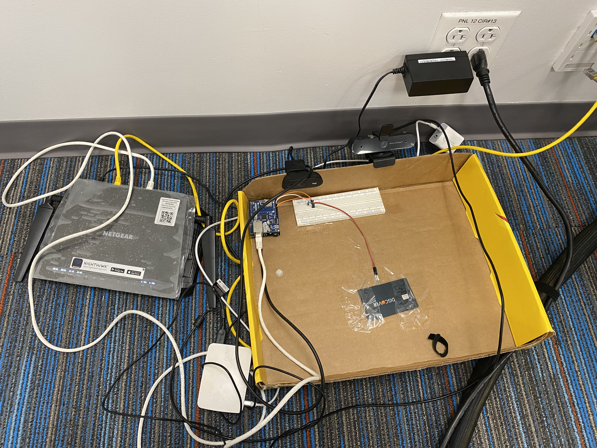

# DeliveryProtect — delivery protection & photo notification (Arduino + Raspberry Pi)

DeliveryProtect is a **low‑cost delivery notification and protection prototype** that detects:

- **Delivery event** (a package is placed down) and notifies you
- **Removal event** (the package is taken away) and notifies you again

Unlike a typical “your package arrived” app notification, DeliveryProtect is designed to create **local, physical evidence** of what happened at your door by attaching a **photo** to the alert.

This repository contains the **full prototype source code** (Arduino + Raspberry Pi), the **demo setup photo**, and the project’s **report/presentation**.

> Note: This README describes the system for both technical and non‑technical audiences. It is not legal advice.

---

## What problem this solves (plain language)

Package theft (“porch piracy”) is common, and existing options often have tradeoffs:

- Delivery-company notifications: not always available and may lack evidence
- Security cameras: can be expensive and record continuously (privacy + bandwidth)
- Locker boxes: may cost hundreds of dollars and require carrier participation

DeliveryProtect explores a different approach: **detect the moment a package is placed and the moment it is removed**, then send **photo-backed alerts** with **minimal power/data usage**.

---

## What it does (in one minute)

1. A **force sensor** under a doormat / platform senses weight changes.
2. An **Arduino + Ethernet shield** reads the sensor and decides whether the package is:
   - **Delivered** (weight crosses a threshold upward), or
   - **Taken** (weight drops back below the threshold).
3. The Arduino sends a tiny message over the local network to a **Raspberry Pi**.
4. The Raspberry Pi:
   - Captures an image from a connected USB camera, and
   - Sends an email alert (optionally with the captured photo attached).

---

## System architecture (high level)

```text
[Force Sensor] → (analog signal) → [Arduino Uno]
                                  |
                                  | HTTP POST over Ethernet (LAN)
                                  v
                           [Raspberry Pi Web Service]
                                  |
                       (capture image via USB camera)
                                  |
                                  v
                            [Email Notification]
```

---

## Demo setup photo



---

## What’s in this repository

- **`Arduino/DeliveryCheck/DeliveryCheck/DeliveryCheck.ino`**
  - Reads the force sensor
  - Applies a threshold to detect “delivered” vs “taken”
  - Sends an HTTP POST to the Raspberry Pi service
- **`Arduino/CheckArduinoIP/CheckArduinoIP.ino`**
  - Helper sketch to print the Arduino’s IP address to the serial monitor
- **`pyservice/webservice.py`**
  - Simple HTTP server that receives Arduino events, optionally captures images, and emails a notification
- **`pyservice/takeImage.py`**
  - Simple script to test camera capture and file output
- **`FinalProjectReport.pdf`**, **`ProjectPresentation.pptx`**
  - Documentation and the rationale/comparison to related approaches

---

## Hardware (bill of materials)

- **Arduino Uno**
- **Arduino Ethernet Shield**
- **Raspberry Pi 4** (other models can work as well)
- **Router / local network (LAN)**
- **Force sensor (FSR)** + **10kΩ resistor** (voltage divider)
- Breadboard + jumper wires
- **1–2 USB cameras** (the code supports separate cameras for “delivered” vs “taken” images)

Cost note (prototype goal): the slide deck frames this as **under ~$30** assuming you already have a Raspberry Pi / basic parts on hand.

---

## How to run it (reproducible steps)

### 1) Wire the sensor

- Use the force sensor (FSR) in a voltage divider with a **10kΩ resistor**
- Feed the divider into the Arduino’s **analog input** (the current code reads `analogRead(0)` via `fsr = 0`)

### 2) Put Arduino + Raspberry Pi on the same LAN

- Connect Arduino Ethernet shield to your router/switch
- Ensure the Raspberry Pi is reachable from the Arduino (same subnet)

### 3) Configure IP addresses / port (important)

In `Arduino/DeliveryCheck/DeliveryCheck/DeliveryCheck.ino`:

- **Raspberry Pi IP**: update `server[]` and the `Host:` header (currently `192.168.1.6`)
- **Arduino IP**: update `IPAddress ip(...)` (currently `192.168.1.2`)
- **Port**: Arduino posts to **`8081`**, which must match the Python service

In `pyservice/webservice.py`:

- The service listens on port **`8081`**

### 4) Upload the Arduino sketch

- Open `DeliveryCheck.ino` in the Arduino IDE
- Select the correct board/port
- Upload
- (Optional) Use `Arduino/CheckArduinoIP/CheckArduinoIP.ino` to confirm the IP printed via Serial

### 5) Configure the Raspberry Pi service

On the Raspberry Pi:

- Install OpenCV for Python (`cv2`) and configure your cameras
- Create an output folder for captured images (the code currently writes to:
  - `/home/pi/Desktop/Kusch/images/parcel.jpg`
  - `/home/pi/Desktop/Kusch/images/taken.jpg`
  )

Email configuration (in `pyservice/webservice.py`) is currently hard-coded placeholders:

- `sender`, `receivers`, `password`

**Do not commit real credentials.** Prefer app passwords and environment variables for real deployments.

### 6) Start the service

Run on the Raspberry Pi:

```bash
python pyservice/webservice.py
```

Then verify in a browser (same LAN) that the service responds:

- `http://<raspberry-pi-ip>:8081/` → “Parcel sensor service running!”

### 7) Demo the workflow

- Place a package on the sensor → “delivered” event
- Remove it → “taken” event
- You should see console logs on the Raspberry Pi and receive email alerts

---

## Important implementation notes (for technical reviewers)

- **Event encoding**: Arduino posts a body of `"0"` (delivered) or `"1"` (taken).
- **Thresholding**: `THRESHOLD` in `DeliveryCheck.ino` controls sensitivity (currently `150`).
- **Debouncing**: The Arduino sketch uses simple state flags (`email_sent`, `email_sent2`) to avoid repeated emails for the same event.
- **Cameras**:
  - `webservice.py` uses `cv2.VideoCapture(<index>)`. You may need to swap indices depending on your USB camera enumeration.
  - In the current repo version, the “delivered” photo capture is commented out, while “taken” capture is enabled. If you want photos for both events, uncomment the “delivered” capture block.
- **Python version**:
  - The service uses `BaseHTTPServer` and legacy `email.*` imports, which align with **Python 2.7**.
  - If you run Python 3, you will likely need to port imports to `http.server` and modern `email.mime.*` modules.

---

## Security, privacy, and responsible use

- **Minimized recording**: This prototype is designed to capture images **only when an event happens**, instead of continuous recording.
- **Email credentials**: Never hard-code or publish real passwords. Use app passwords, secrets managers, or environment variables.
- **Consent & legality**: If deployed beyond a private residence, ensure you comply with local laws and any building/community policies.

---

## Limitations (current prototype)

- Handles a single “delivered ↔ taken” cycle; multiple packages/deliveries require additional logic.
- Sensor placement and threshold tuning are necessary to reduce false positives (wind, pets, partial lifts).
- Network and power availability are required (LAN connectivity for Arduino, uptime for Raspberry Pi).

---

## Future work (from the project presentation)

1. Handle **multiple deliveries** reliably
2. **Recognize the owner** (e.g., avoid alerts when the recipient retrieves the package)
3. Add an **alarm** while the parcel is being taken away

---

## Documentation artifacts

- `FinalProjectReport.pdf`: full write-up of design and evaluation
- `ProjectPresentation.pptx`: project overview, comparison to alternatives, and demo narrative

